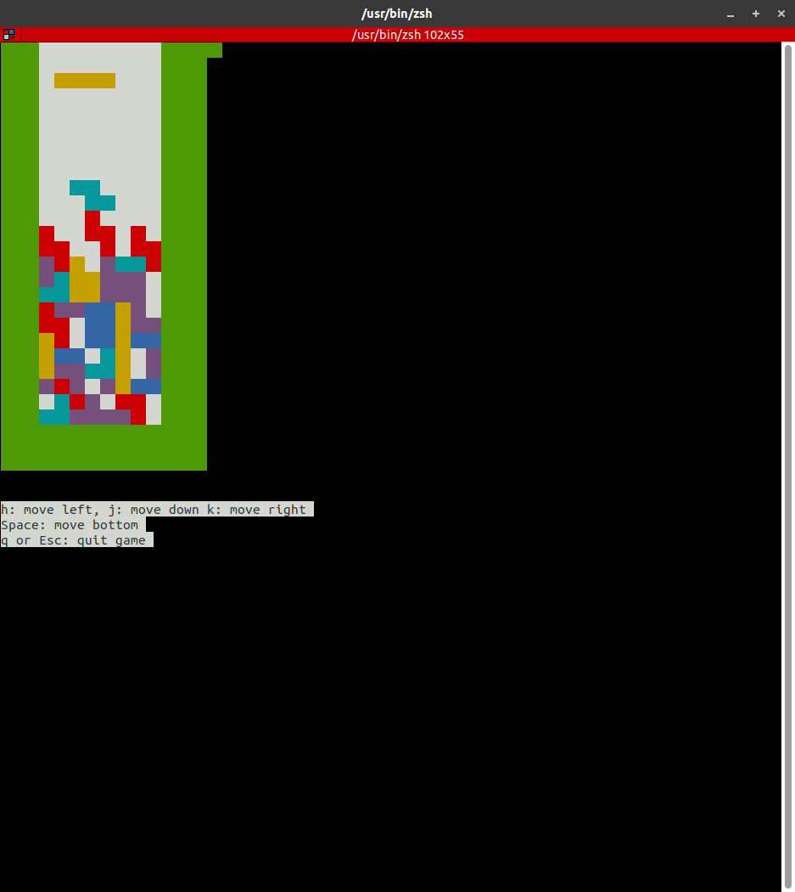

# tetris

[](https://travis-ci.org/jiro4989/tetris)

ターミナル上で動作するテトリス



## 開発環境

    go version go1.11 linux/amd64

## インストール方法

以下のコマンドを実行する。

```bash
go get github.com/jiro4989/tetris
```

または、GitHubReleaseのページからダウンロードする。

## 遊び方

以下のコマンドで起動

```bash
tetris
```
