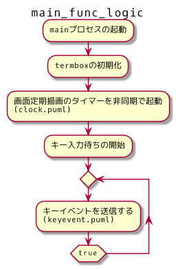
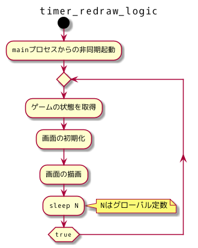
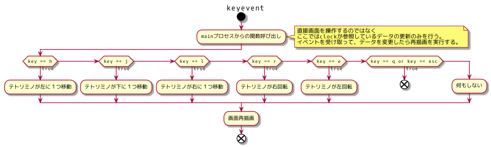
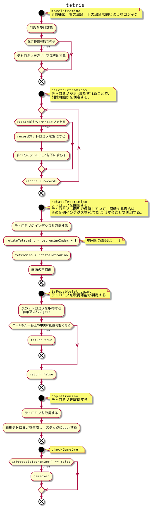

# 設計

妄想レベルだけれどこういう方針で実装したい、というものを記載。

## main

アプリが起動された時に最初に処理される関数。
非同期タイマーをgoroutineで起動してからキー入力待ち状態になる。

## clock

mainから呼び出されて非同期でターミナル画面を再描画しつづけるだけ。
再描画に使用するデータは別の関数が更新する。

このプロセスはひたすら画面の再描画のみを行って、
データの更新は一切行わない。

## keyevent

main関数からキーイベントを受け取って、それに応じてデータを更新する。
わざわざファイルをわけているけれど、ただの関数。非同期ですらない。
といってもこのソースファイルは条件分岐のみを行って関数呼び出しのみおこなう。

ロジック部分は、別のソースファイルに書かれる想定。

## tetris

ゲームのコアロジック。

